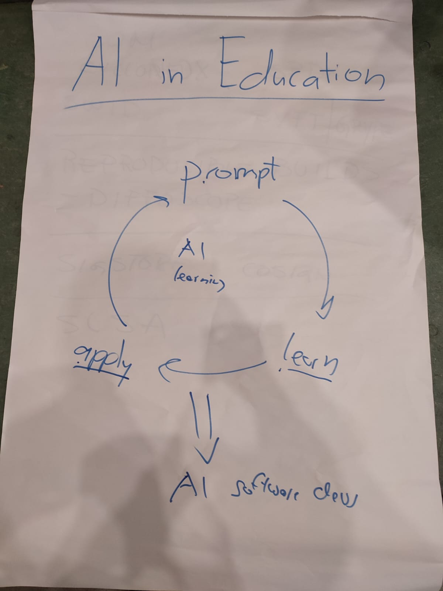

# AI in Education

Convenor: Cassandra Chin

In this session we discussed the current problem of teaching AI in the education system. Computer Science curricula in schools currently don't teach students AI and discourage it, while companies are looking for candidates who know how to use AI tools. We discussed and landed on a Prompt > Learn > Apply methology of learning to code with AI. This would involve a heavy curriculum and style of learning change, but this would train the next generation of Computer Science students to be ready for the AI industry.

